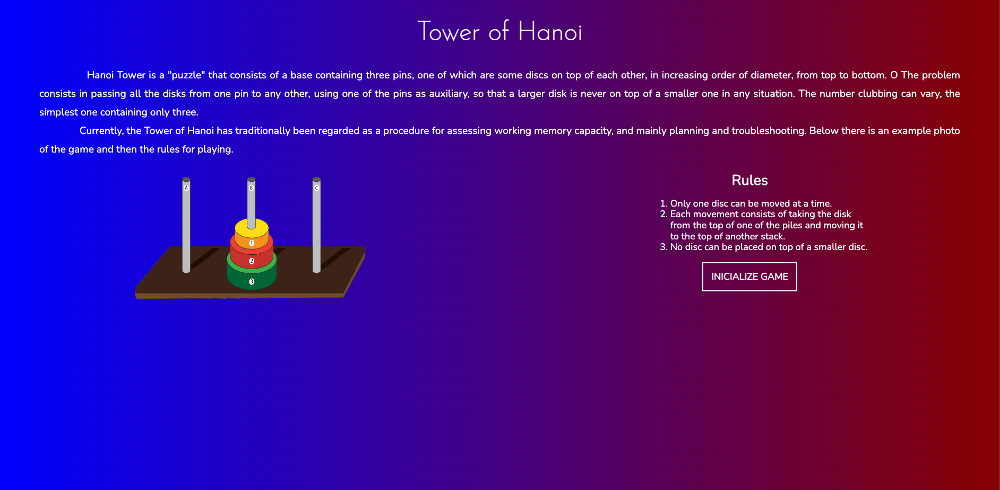
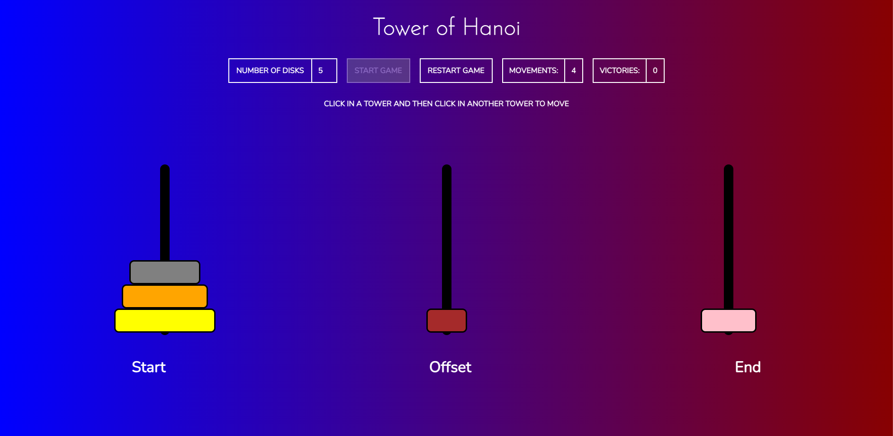

# Tower of Hanoi Game

This repository contains the source code for a Tower of Hanoi game created using HTML, CSS, and JavaScript. This project was developed as a learning exercise to gain hands-on experience with these technologies.

## About the Project

The Tower of Hanoi is a classic puzzle game that involves moving a set of disks from one rod to another, following specific rules:

1. Only one disk can be moved at a time.
2. A disk can only be placed on top of a larger disk or an empty rod.
3. The objective is to move all the disks from the source rod to the target rod, using the auxiliary rod as needed.

## Technologies Used

- **HTML**: For structuring the game layout.
- **CSS**: For styling the game interface.
- **JavaScript**: For implementing the game logic and interactions.

## How to Play

1. Open the `index.html` file in your web browser.
2. Use your mouse to click and drag disks from one rod to another, following the game rules.
3. Try to move all the disks from the leftmost rod to the rightmost rod in the fewest moves possible.

## Demo

## Acknowledgements

This project was inspired by the classic Tower of Hanoi puzzle. It serves as a practical exercise to understand the basics of HTML, CSS, and JavaScript.
